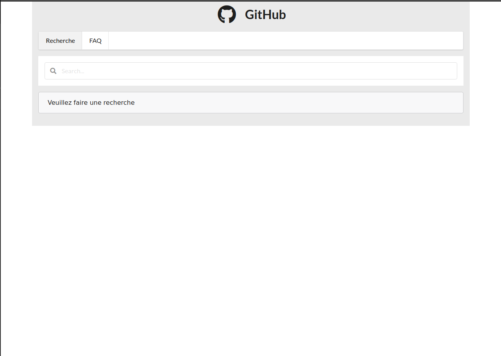
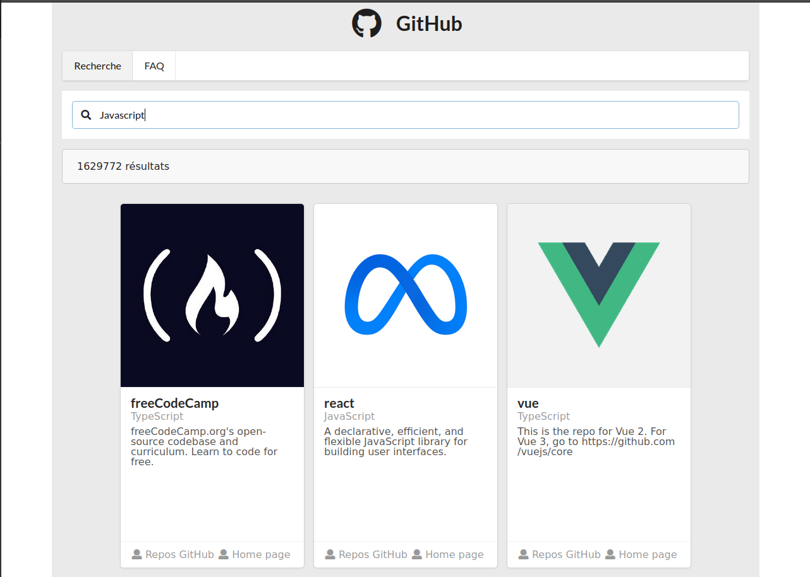

# React-avec-GitHub

 

Voici une simple application Web qui permet de chercher n'importe quel ripo sur Github.

## Fonctionnalités futures

je n'en vois aucune pour le moment...

https://github-react.surge.sh/
